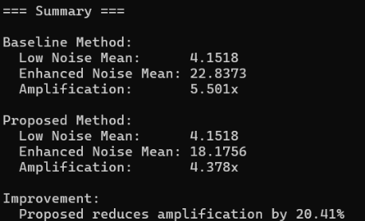
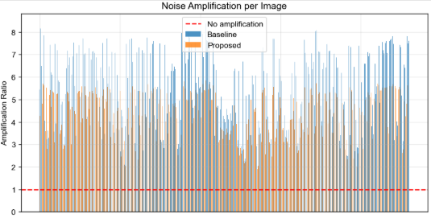
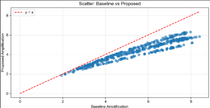

# Image Processing Final Project Team8 - Low-Light Image Enhancement for Night Photography 
## Task Overview
The project focuses on improving low-light image enhancement while mitigating the noise amplification problem that commonly appears in Zero-DCE–based methods.
Standard Zero-DCE enhances brightness through iterative curve estimation, but this process also magnifies sensor noise, especially in dark, flat regions.
Your proposed method introduces a noise-aware enhancement mechanism, aiming to preserve Zero-DCE’s lightweight, real-time properties while achieving better noise suppression.

To address this, the project:

1. Analyzes weaknesses in Zero-DCE such as noise amplification, quality degradation, and instability in extremely dark scenes.

1. Proposes a hybrid noise-map–guided loss function to penalize noise amplification during training.

1. Evaluates performance through noise amplification metrics, bar charts, scatter plots, and visual comparisons.

The result is an approach that maintains similar enhancement quality while reducing noise amplification by ~20%, depending on the loss design.

## Usage
train
```
cd Zero-DCE_code
python lowlight_train.py
```

test
```
cd Zero-DCE_code
python lowlight_test.py
```

analyze

first, copy the result of test to a folder in analyze folder.

then change the path in the analyze/Evaluation_metrics.py

```
cd analyze
python Evaluation_metrics.py
```

## Hyperparameters
```
# loss 1: use  "noise_increase = F.relu(noise_diff)" in L_noise_map_penalty

loss_exp = 19*torch.mean(L_exp(enhanced_image))

loss_noise_map = 30 * (torch.mean(L_noise_map(img_lowlight, enhanced_image)))

# loss 2: use  "noise_increase = torch.pow(F.relu(noise_diff), 2)" in L_noise_map_penalty

loss_exp = 10*torch.mean(L_exp(enhanced_image))

loss_noise_map = 55 * (torch.mean(L_noise_map(img_lowlight, enhanced_image)))
```

## Experiment Results
* Improvement
* loss1:



* loss2:


* Orange bar means the amplification ratio of baseline for each input image
* Blue bar means the amplification ratio of our approach for each input image
* loss1:


* loss2:



* Each point represents the numerical statistics of baseline and proposed approach
* loss1:



* loss2:


* **Image Comparison**


